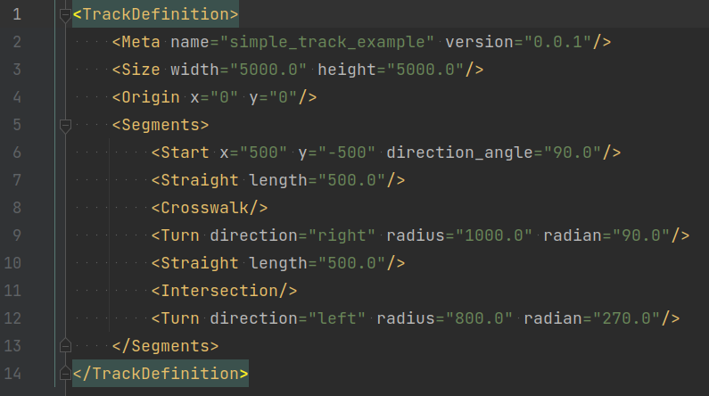
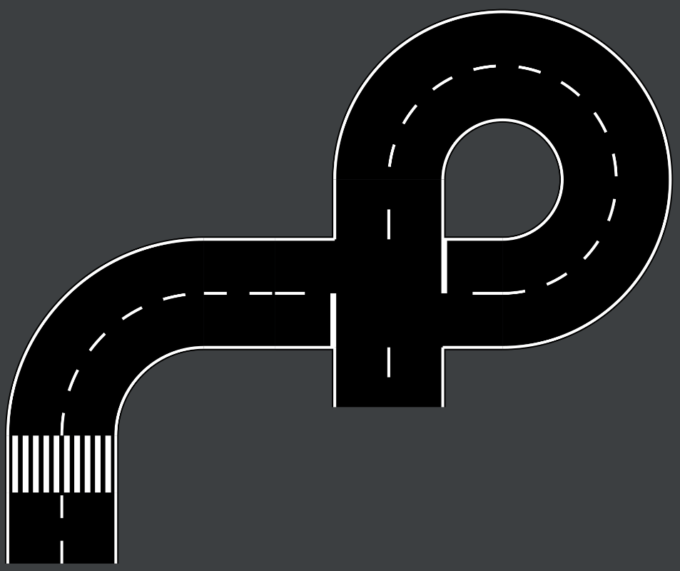

# Track Generator

Simple generator to create tracks (ground textures for vehicle simulations)
from parametric descriptions.

For example, the following parametric description of a track in XML will lead
to the corresponding result:

**Track definition (XML):**

**Output (SVG, optional PNG):**

### Usage

## Create a virtual environment

    python -m venv venv
    # Windows:
    venv\Scripts\activate
    # Linux (bash):
    source venv/bin/activate

# Clone project, setup venv and install requirements:

    git clone git@github.com:karad94/track_generator.git
    cd track_generator/
    python -m venv venv
    source venv/bin/acitvate.bash
    pip install -r requirements.txt
    python3 setup.py install

# Run with example track definition:

    track_generator generate_track YOUR_TRACK_DEFINITION

# Generating Gazebo Model
    
    track_generator generate_track --gazebo YOUR_TRACK_DEFINITION

# Run Track in Gazebo

    cd output/YOUR_TRACK/gazebo_models
    source setup.bash
    gazebo YOUR_TRACK.world